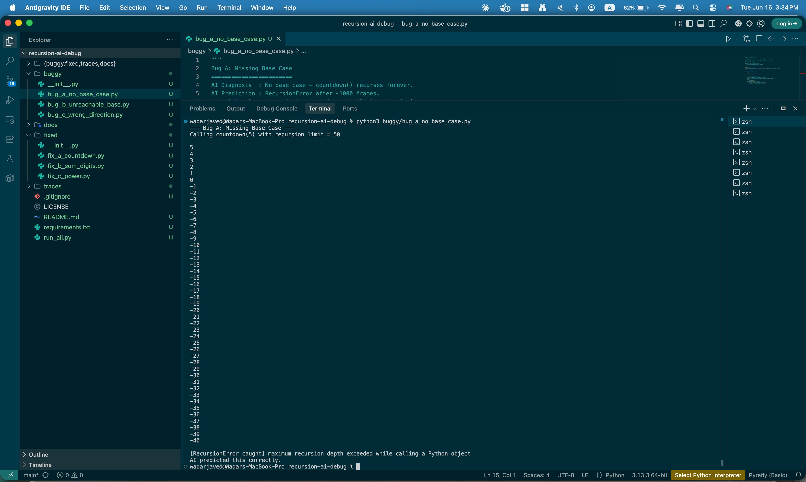
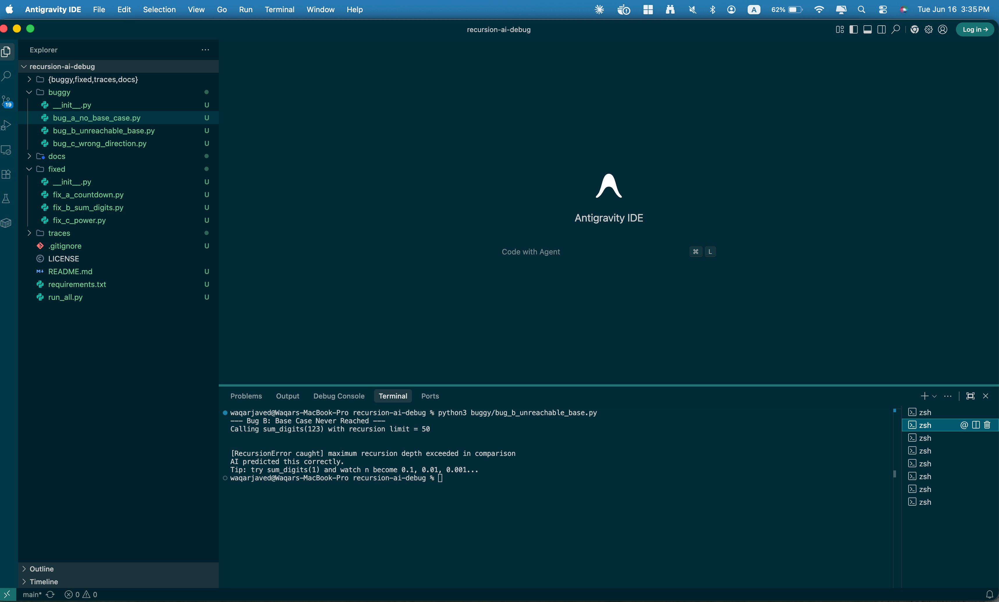
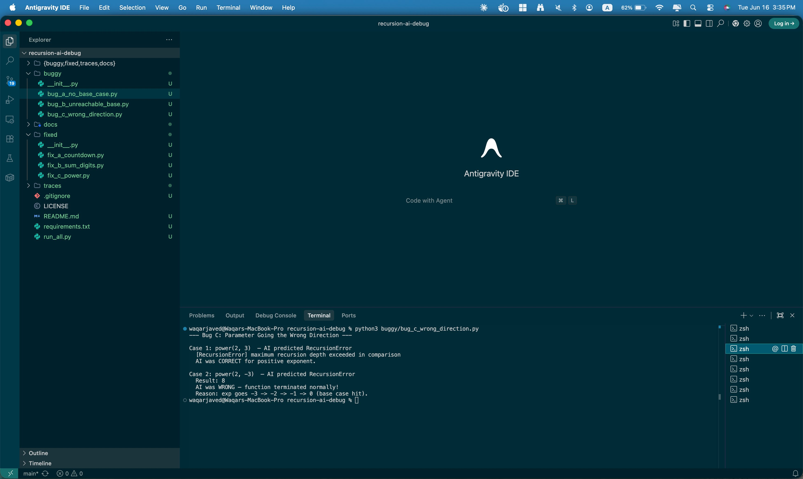
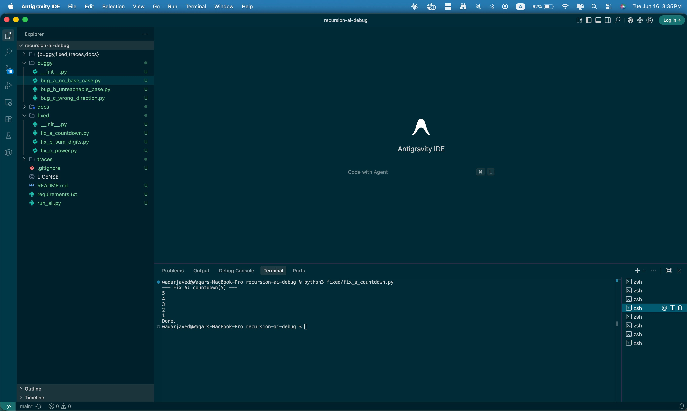
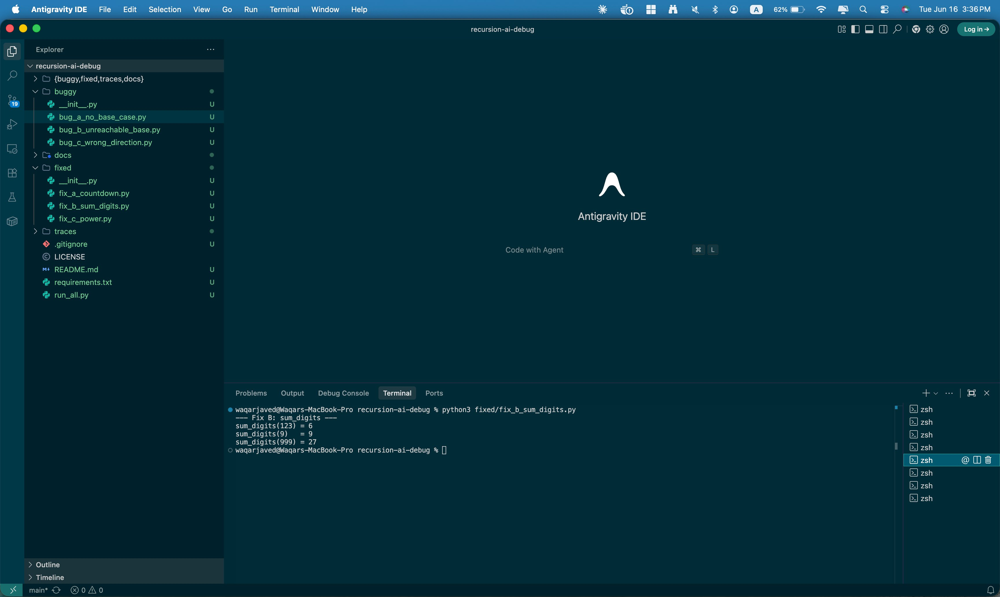
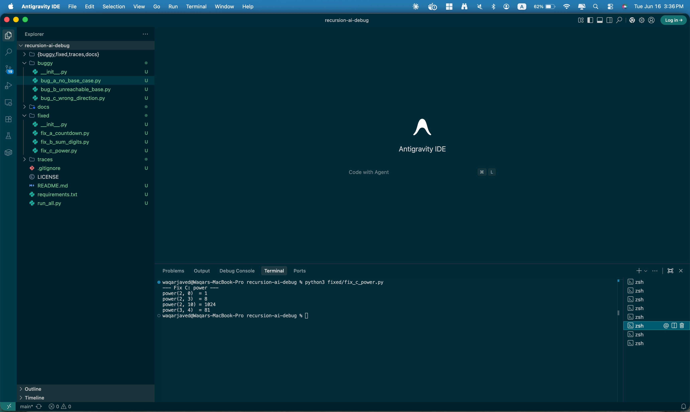
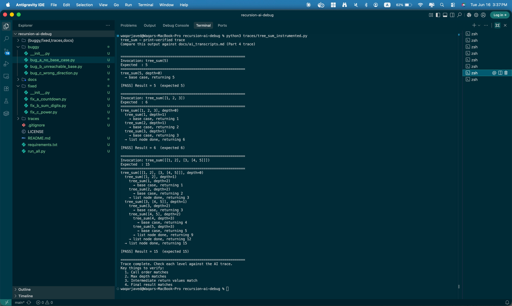

# 🔍 recursion-ai-debug

> Using AI to diagnose, trace, and verify recursive Python functions — and learning exactly when to trust it.

A hands-on tutorial exploring how AI tools (Claude, ChatGPT) handle recursive code analysis: where they shine, where they silently fail, and how to build the discipline of verifying AI traces with real execution.

---

## 📖 What This Repo Covers

| Component | File(s) | What you'll learn |
|-----------|---------|-------------------|
| 3 buggy functions | `buggy/` | Spot missing base cases, unreachable conditions, wrong-direction parameters |
| AI debugging transcripts | `docs/ai_transcripts.md` | How to prompt AI for bug diagnosis, runtime prediction, and fixes |
| Verification table | `docs/verification.md` | Comparing AI predictions to actual Python output |
| Wrong-prediction case | `docs/wrong_prediction.md` | The edge case that caught the AI off guard |
| AI trace vs print trace | `traces/` | Call-by-call stack comparison for a working tree walker |
| Reflection | `docs/reflection.md` | When to trust AI for recursion — and when to always run the code |

---

## 🗂 Repository Structure

```
recursion-ai-debug/
├── buggy/
│   ├── bug_a_no_base_case.py          # countdown() — missing base case
│   ├── bug_b_unreachable_base.py      # sum_digits() — float division never hits 0
│   └── bug_c_wrong_direction.py       # power() — parameter grows away from base case
├── fixed/
│   ├── fix_a_countdown.py
│   ├── fix_b_sum_digits.py
│   └── fix_c_power.py
├── traces/
│   ├── tree_sum.py                    # Working recursive tree walker
│   └── tree_sum_instrumented.py       # Same function with depth-tracking print statements
├── screenshots/                       # Local execution evidence
│   ├── bug_a_missing_base_case.png
│   ├── bug_b_unreachable_base.png
│   ├── bug_c_wrong_direction.png
│   ├── fix_a_countdown.png
│   ├── fix_b_sum_digits.png
│   ├── fix_c_power.png
│   └── tree_sum_instrumented_trace.png
├── docs/
│   ├── ai_transcripts.md
│   ├── verification.md
│   ├── wrong_prediction.md
│   └── reflection.md
├── run_all.py                         # Runs every script and captures output
├── requirements.txt
└── README.md
```

---

## 🚀 Quick Start

### Prerequisites
- Python 3.8 or higher
- No external packages required (stdlib only)

### 1. Clone the repo

```bash
git clone https://github.com/YOUR_USERNAME/recursion-ai-debug.git
cd recursion-ai-debug
```

### 2. Run a single buggy function safely

```bash
python buggy/bug_a_no_base_case.py
```

Each buggy file sets `sys.setrecursionlimit(50)` so your machine won't hang. You'll see the RecursionError after ~50 frames — safe and fast.

### 3. Run the fixed versions

```bash
python fixed/fix_a_countdown.py
python fixed/fix_b_sum_digits.py
python fixed/fix_c_power.py
```

### 4. Run the AI trace vs print trace comparison

```bash
python traces/tree_sum_instrumented.py
```

### 5. Run everything at once

```bash
python run_all.py
```

---

## 🐛 The Three Bugs

### Bug A — Missing Base Case

```python
def countdown(n):
    print(n)
    return countdown(n - 1)   # recurses forever — no stop condition
```

**AI prediction:** RecursionError after ~1000 frames. ✅ Correct.

**Fix:** Add `if n <= 0: return` before the recursive call.

#### Execution screenshot



> Terminal shows countdown printing 5, 4, 3 … into negative numbers before hitting `[RecursionError caught] maximum recursion depth exceeded`. AI predicted this correctly.

---

### Bug B — Base Case Never Reached

```python
def sum_digits(n):
    if n == 0:
        return 0
    return (n % 10) + sum_digits(n / 10)   # float division: n never equals 0 exactly
```

**AI prediction:** RecursionError — float never hits integer 0. ✅ Correct.

**Fix:** Change `n / 10` to `n // 10` (integer floor division).

#### Execution screenshot



> Terminal confirms `[RecursionError caught] maximum recursion depth exceeded in comparison`. The tip at the bottom explains that `n` becomes `0.1, 0.01, 0.001…` and never reaches exactly `0`.

---

### Bug C — Parameter Going the Wrong Direction

```python
def power(base, exp):
    if exp == 0:
        return 1
    return base * power(base, exp + 1)   # exp grows — moves away from base case
```

**AI prediction:** RecursionError for **all inputs**. ❌ **Wrong for negative inputs.**

**Fix:** Change `exp + 1` to `exp - 1`.

#### Execution screenshot



> Case 1: `power(2, 3)` → RecursionError ✅ (AI correct).
> Case 2: `power(2, -3)` → **Result: 8 — AI was WRONG.** With a negative starting exponent, `exp + 1` counts *up toward* `0`. The base case fires at `exp == 0` and the function returns normally.
>
> **This is the key wrong-prediction example of the assignment.**

---

## ✅ Fixed Versions — Execution Evidence

### Fix A — countdown working correctly



> `countdown(5)` now prints 5, 4, 3, 2, 1 and exits cleanly with "Done."

---

### Fix B — sum_digits working correctly



> `sum_digits(123) = 6`, `sum_digits(9) = 9`, `sum_digits(999) = 27` — all correct.

---

### Fix C — power working correctly



> `power(2,0)=1`, `power(2,3)=8`, `power(2,10)=1024`, `power(3,4)=81` — all correct.

---

## 🌳 The Working Function — tree_sum Trace

### AI trace vs print-verified output



> Full call-by-call trace for all 3 invocations. All pass. The printed output matches the AI trace in `docs/ai_transcripts.md` exactly — call order, intermediate return values, max depth (3, 0-indexed = 4 frames), and final results.

```python
def tree_sum(node):
    if isinstance(node, int):
        return node
    return sum(tree_sum(child) for child in node)
```

| Input | Expected | Result | AI trace correct? |
|-------|----------|--------|-------------------|
| `tree_sum(5)` | 5 | 5 | ✅ Yes |
| `tree_sum([1, 2, 3])` | 6 | 6 | ✅ Yes |
| `tree_sum([[1,2],[3,[4,5]]])` | 15 | 15 | ✅ Yes |

---

## 🤖 AI Reliability Guide

| Situation | Trust the AI? |
|-----------|--------------|
| Linear recursion, depth < 10 | ✅ Yes — reliable |
| Bug identification (structural) | ✅ Yes — strong |
| Proposed fix syntax | ✅ Yes — but verify with a test run |
| Branching recursion (Fibonacci, tree), depth > 6 | ⚠️ Verify with prints |
| Edge-case or negative inputs | ❌ Always run the code |
| CPython tail-call optimization claims | ❌ Never trust — CPython does NOT optimize tail calls |
| Exact return values at depth > 15 | ❌ Always run the code |

---

## 📝 Assignment Context

This repo is the deliverable for **Module 5: AI for Recursion Tracing and Debugging** — Applied Generative AI, Atlantis University. It fulfills all 6 required components:

1. ✅ Diagnose 3 buggy functions with AI
2. ✅ Run and verify predictions
3. ✅ Document the wrong prediction
4. ✅ AI call-by-call trace of working function
5. ✅ Print-verified comparison
6. ✅ Reflection on AI traceability

---

## 📚 References

- [Python `sys.setrecursionlimit`](https://docs.python.org/3/library/sys.html#sys.setrecursionlimit)
- [Python `pdb` debugger](https://docs.python.org/3/library/pdb.html)
- [Python Recursion FAQ](https://docs.python.org/3/faq/programming.html#how-do-i-use-strings-to-call-functions-methods)

---

## 📄 License

MIT — free to use, adapt, and share for educational purposes.
